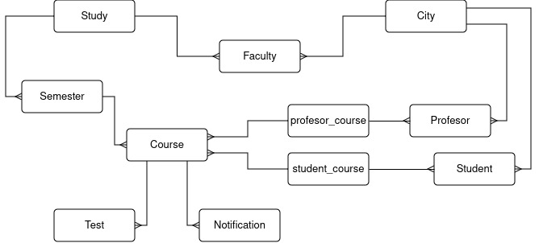

# Database

## Entities
- City
- Faculty
- Study
- Semester
- Course
- Test
- Student
- Profesor
- Notification
- profesor_course
- student_course

## Atributes

#### City
- <ins>postNumber</ins>
- cityName

#### Faculty
- <ins>facultyID</ins>
- facultyName
- street
- streetNumber
- contactNumber
- contactMail
- *cityID*

#### Study
- <ins>studyID</ins>
- studyName
- type (strucni/sveucilisni)
- firstDegree
- secondDegree
- *facultyID*

#### Semester
- <ins>semesterID</ins>
- semesterOrdinalNumber
- *studyID*

#### Course
- <ins>courseID</ins>
- courseName
- ECTS
- description
- *semesterID*

#### Test
- <ins>testID</ins>
- grade
- *courseID*

#### Student
- <ins>studentID</ins>
- studentName
- studentSurname
- dateOfBirth
- gender
- street
- streetNumber
- *cityID*

#### Profesor
- <ins>profesorID</ins>
- profesorName
- profesorSurname
- title
- dateOfBirth
- gender
- street
- streetNumber
- *cityID*

#### Notification
- <ins>notificationID</ins>
- title
- content
- *courseID*

#### profesor_course
- *profesorID*
- *courseID*

#### student_course
- dateOfEnrollment
- *studentID*
- *courseID*

## Relations

